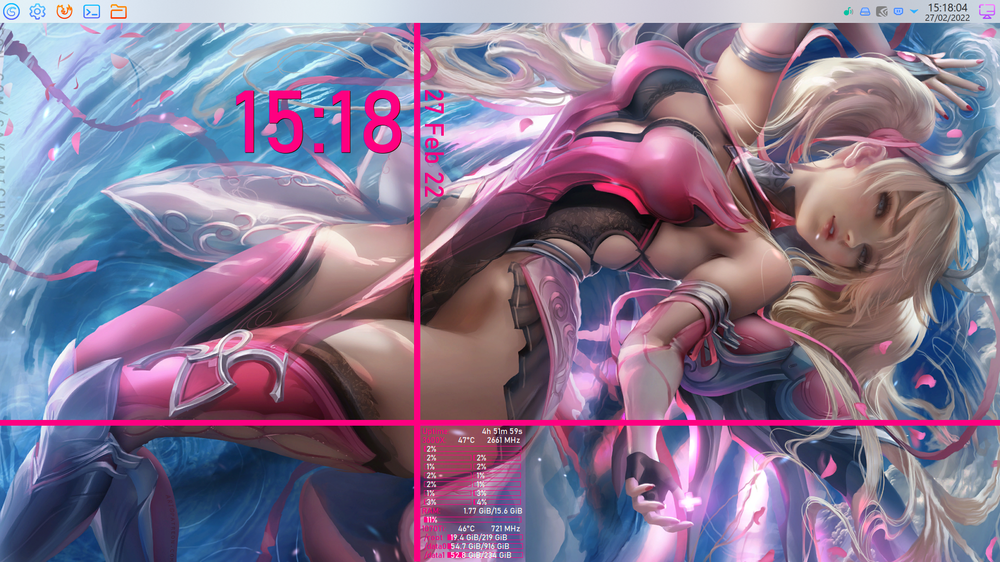

# pinkisch
 
Theme / Configuration files for Conky 1.10+
 

## Installation

Copy files to ~/.conky/pinkisch/. Run conky.sh to start widgets.

In case of a different theme catalog change paths in `conky.sh` and path to lua file in `conky3.sh`.

## Credits + Info

Lua text widget for Conky by Wlourf ([http://u-scripts.blogspot.com/2010/06/text-widget.html](http://u-scripts.blogspot.com/2010/06/text-widget.html))

Wallpaper Engine for KDE by catsout ([https://github.com/catsout/wallpaper-engine-kde-plugin](https://github.com/catsout/wallpaper-engine-kde-plugin))

Wallpaper: Pink Mercy by sakimichan ([https://www.deviantart.com/sakimichan/art/Pink-Mercy-746057859](https://www.deviantart.com/sakimichan/art/Pink-Mercy-746057859)) 

Animated version for Wallpaper Engine by 盯着贞子唱忐忑 ([https://steamcommunity.com/sharedfiles/filedetails/?id=1412269939](https://steamcommunity.com/sharedfiles/filedetails/?id=1412269939))

Environment: KDE Plasma, Style: Future, Icons: BeautyLine